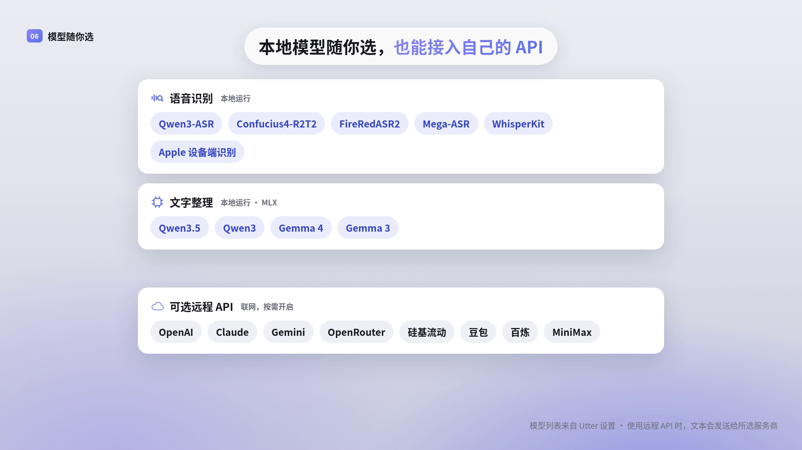
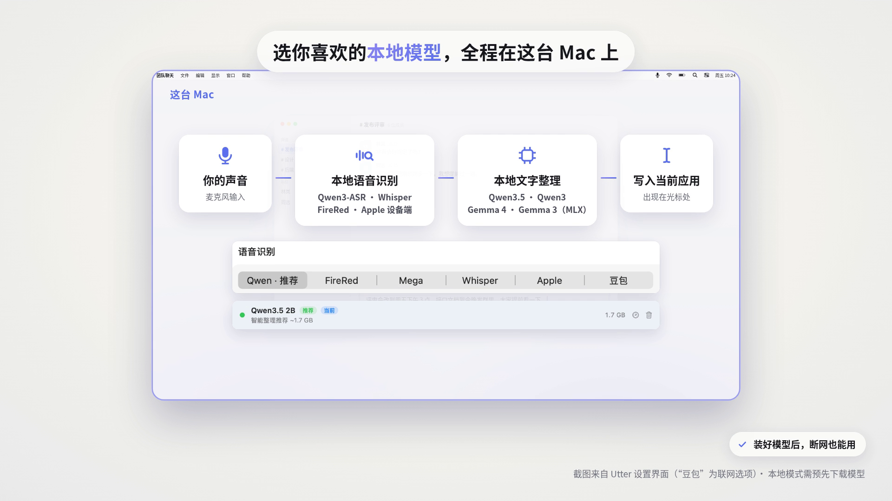

<div align="center">

# Utter

**macOS 菜单栏 AI 语音输入**

---

[](https://github.com/IchenDEV/utter/stargazers)
[](https://github.com/IchenDEV/utter/network/members)
[](https://github.com/IchenDEV/utter/issues)

[](https://www.apple.com/macos/)
[](https://swift.org)
[](https://www.apple.com/mac/m1/)
[](LICENSE)

[](https://github.com/argmaxinc/argmax-oss-swift)
[](https://github.com/ml-explore/mlx-swift-lm)

[官网](https://utter.idevlab.dev) · [English](README.md)

</div>

---

## 项目简介

**Utter** 是一款 macOS 菜单栏 AI 语音输入与听写应用，支持完全本地推理和远程 LLM API 两种模式。按住快捷键开始录音，松开后自动转写，结果直接输入到当前激活的应用中。

三种输出模式：

- **原文直出** — 语音识别原始结果，延迟最低
- **智能整理** — LLM 根据上下文清理语气词、修正口误、结构化排版
- **语音指令** — 说出指令，AI 结合屏幕内容生成回复

## 演示视频

<p align="center"><a href="https://utter.idevlab.dev/#videos"></a> <a href="https://utter.idevlab.dev/#videos"></a> <a href="https://utter.idevlab.dev/#videos"></a></p>

可在[官网](https://utter.idevlab.dev/#videos)观看，或直接下载 MP4：[功能一览 (0:51)](docs/assets/videos/utter-features-51s-zh-vo.mp4) · [办公室里的一天 (0:58)](docs/assets/videos/utter-day-58s-zh-vo.mp4) · [本地语音输入 (0:28)](docs/assets/videos/utter-offline-28s-zh-vo.mp4)。三支均为普通话配音；界面为真实应用的动画重建，示例文本仅作演示。

## 功能特性

| 功能 | 说明 |
|---|---|
| **多语音引擎** | 本地 Qwen3-ASR、Confucius4-R2T2、FireRedASR2、Mega-ASR、WhisperKit 或设备端 Apple 语音识别；豆包语音识别为远程选项 |
| **智能文字处理** | 本地 MLX 模型（Qwen3.5 / Qwen3 / Gemma）或远程 LLM 理解口述意图 — 上下文感知的语气词清理、“算了/删掉刚才”重说处理、自动纠正、口述标点、技术词、数字/范围/单位和列表格式化 |
| **LLM 负责口述格式** | 大小写、无空格、标识符、文件路径、快捷键、表情、Markdown 任务、日期时间、数量、单位、公式、分数和数字串都由智能整理/语音指令提示词交给 LLM 判断，不在本地写死替换规则 |
| **语音编辑口令** | 在语音指令模式下，由 LLM 分类安全结构化动作，支持上一段/选区替换、撤销、校对、跨语言回复起草、接受/拒绝/追问回复、会议纪要、关键要点/结论/问题/风险/截止时间/负责人/行动项提取、标题化、摘要、语气改写、扩写、表格化、列表化、删除与改写口令 |
| **直出与预览边界** | 原文直出、流式 HUD、集成 partial 和快速插入草稿尽量保留 ASR 原文，只做词库、空白、重复转写和非语音垃圾过滤 |
| **远程 LLM** | 支持 OpenAI、Claude（Anthropic 格式）、Gemini、OpenRouter、硅基流动、豆包、百炼、MiniMax（国内/海外） |
| **全局快捷键** | 可配置按键（Fn/Ctrl/Shift/Option），支持长按、双击、单击三种触发模式 |
| **翻译听写** | 使用独立组合键，说一种语言，直接输入英语、中日韩、西班牙语、法语或德语译文 |
| **屏幕上下文 OCR** | 通过 ScreenCaptureKit + Vision 截取屏幕文字，辅助 LLM 纠正同音字 |
| **语音指令模式** | 屏幕感知的语音助手 — 总结、回复、翻译屏幕内容 |
| **输入记忆** | 近期输入历史作为 LLM 上下文，提升连续输入准确度 |
| **行业词库** | 可选医疗、法律、金融财会或软件技术词库，为 Apple Speech / Whisper 提供优先术语并辅助输出规范化；个人词条优先 |
| **编辑规则** | 自定义文本替换规则，每次输出自动应用 |
| **语言风格预设** | 口语 / 专业 / 自定义提示词 |
| **输入历史与统计** | 完整历史记录，原始文本与润色结果对比，字数统计，可配置保留时长 |
| **双语界面** | 中英文界面切换，独立于识别语言设置 |
| **音效反馈** | 录音开始/停止时播放提示音 |
| **引导式新手教程** | 分步设置：权限授予、模型下载、首次使用 |

## 系统要求

- **系统**：macOS 26 (Tahoe) 或更高版本
- **芯片**：Apple Silicon（M1 / M2 / M3 / M4）
- **空间**：最低约 0.7 GB（Apple 语音 + Qwen3.5 0.8B）；默认配置（Apple 语音 + Qwen3.5 2B）约 1.8 GB；更大的识别和整理模型还需要数 GB

## 安装

### 下载安装

从 [Releases](https://github.com/IchenDEV/utter/releases) 页面下载最新 `.dmg`，打开后将 **Utter.app** 拖入"应用程序"文件夹。

> **首次打开提示"无法验证开发者"？** 由于应用未经 Apple 公证，首次运行前需在终端执行：
> ```bash
> xattr -cr /Applications/Utter.app
> ```
> 或在"系统设置 → 隐私与安全性"中点击"仍然打开"。

### 从源码构建

```bash
# 构建 .app 包 + .dmg 安装器
bash scripts/build-app.sh

# 或开发模式
swift build
swift run OpenType

# 构建、签名并启动开发用 .app 包
bash scripts/build-and-run.sh --verify

# 或在 Xcode 中打开
open Package.swift
```

实质性改动遵循 [`docs/sdlc/README.md`](docs/sdlc/README.md) 中的 Artifact 驱动流程。
提交 Pull Request 前请运行：

```bash
bash scripts/sdlc-checks.sh
bash scripts/ci-basic-checks.sh
swift test
```

对外应用名为 `Utter.app`；Swift 包产物暂时保留 `OpenType`，以兼容现有源码集成和升级路径。

## 首次使用

1. 启动 Utter — 菜单栏出现波形图标
2. 新手引导自动启动，引导完成权限和模型配置
3. 授予 **麦克风** 和 **辅助功能** 权限（必需）
4. 等待默认整理模型（Qwen3.5 2B，约 1.7 GB）下载完成，仅首次
5. 长按 **Fn** 键开始语音输入，松开后文字自动插入当前位置

## 权限说明

| 权限 | 用途 | 必需 |
|---|---|---|
| 麦克风 | 语音采集 | 是 |
| 辅助功能 | 全局快捷键、文本写入（剪贴板 + 模拟 ⌘V）、读取当前输入框内容作为上下文 | 是 |
| 语音识别 | Apple 语音识别引擎 | 使用 Apple Speech 时需要 |
| 屏幕录制 | OCR 屏幕文字辅助纠错 + 语音指令模式 | 可选 |
| 网络 | 下载模型；远程 LLM API 调用 | 首次运行 / 远程 LLM 模式 |

## 本地模型

以下模型都在你的 Mac 上运行。模型下载一次后，断网也能继续听写。

| 环节 | 模型 | 说明 |
|---|---|---|
| 语音识别 | Qwen3-ASR 1.7B（推荐）、Confucius4-R2T2、FireRedASR2-AED、Mega-ASR、WhisperKit（large-v3-turbo … tiny）、Apple 语音识别（设备端） | Qwen3-ASR 与 Confucius 通过原生 Swift + MLX 运行；FireRed、Mega-ASR 通过 MLX 运行；Apple 语音强制设备端识别 |
| 文字整理（LLM） | Qwen3.5 0.8B / **2B（默认）** / 9B / 35B-A3B、Qwen3 0.6B–30B-A3B、Qwen2.5、Gemma 4 E2B / E4B、Gemma 3 1B / 4B / 12B | 基于 Apple Silicon 上的 MLX；实验性的 ANE-LM 运行时可运行本地 Qwen3 模型；也可以添加自己的 MLX 模型 |

远程选项需要手动开启：豆包（火山引擎）语音识别和下方的远程 LLM 服务商会把音频或文本发送给对应服务商。

## 远程 LLM 服务商

Utter 同时支持 **OpenAI 兼容** 和 **Anthropic** 两种 API 格式：

| 服务商 | API 格式 | 接口地址 |
|---|---|---|
| OpenAI | OpenAI | `https://api.openai.com/v1` |
| Anthropic Claude | Anthropic | `https://api.anthropic.com/v1` |
| Google Gemini | OpenAI | `https://generativelanguage.googleapis.com/v1beta/openai` |
| OpenRouter | OpenAI | `https://openrouter.ai/api/v1` |
| 硅基流动 | OpenAI | `https://api.siliconflow.cn/v1` |
| 火山引擎豆包 | OpenAI | `https://ark.cn-beijing.volces.com/api/v3` |
| 阿里百炼 | OpenAI | `https://dashscope.aliyuncs.com/compatible-mode/v1` |
| MiniMax（国内） | OpenAI | `https://api.minimax.chat/v1` |
| MiniMax（海外） | OpenAI | `https://api.minimaxi.chat/v1` |

## 项目结构

```
Sources/
├── App/          # 应用入口、AppDelegate、状态管理、语音管道、应用图标
├── Audio/        # 麦克风录音（AVAudioEngine）、音效播放
├── Config/       # 用户设置、模型目录、远程模型配置、多语言
├── Hotkey/       # 全局快捷键（CGEvent tap）
├── LLM/          # 本地推理引擎（MLX）、远程客户端（OpenAI/Anthropic）
├── Output/       # 文本写入（剪贴板 + 模拟 ⌘V；辅助功能用于读取选区和上下文）
├── Processing/   # 文本处理器、输入历史、记忆系统、个人与行业词库
├── Prompts/      # 提示词构建、固定提示词目录、风格提示词预设
├── Screen/       # 屏幕 OCR（ScreenCaptureKit + Vision）
├── Speech/       # 语音识别协议、WhisperKit 引擎、Apple Speech 引擎、豆包语音识别引擎、本地语音识别引擎
├── UI/           # SwiftUI：菜单栏、设置面板、新手引导、浮动 HUD、历史、模型管理
└── Resources/    # 本地化字符串（中/英）、音效、应用图标
docs/             # 官网（GitHub Pages，含演示视频）、SDLC 文档、调研
marketing/        # 宣传片源工程、渲染引擎、配音脚本
scripts/
├── build-and-run.sh        # 构建、签名并启动开发用 .app 包
├── build-app.sh            # 构建发布用 .app 包和 .dmg 安装器
├── ci-basic-checks.sh      # CI 文件关联和资源检查
├── create-signing-cert.sh  # 生成自签名代码签名证书
├── evaluate-voice-quality.py # 评估识别与整理结果（字错率、术语、数字、延迟）
├── generate-icon.swift     # 从源 PNG 生成 AppIcon.icns
├── render-promo.sh         # 渲染 marketing/<promo>/ 下的宣传片
├── sdlc-checks.sh          # 校验 SDLC 文档阶段与审批
├── test-industry-lexicons.sh # 验证行业词库、术语召回和非目标文本保真
├── unit-test-coverage.sh   # 运行单元测试并检查覆盖率
└── validate-volc-asr.swift # 手动验证火山引擎 ASR 配置
```

## 技术栈

- [WhisperKit](https://github.com/argmaxinc/argmax-oss-swift) — 离线 Whisper 语音识别
- [mlx-swift-lm](https://github.com/ml-explore/mlx-swift-lm) — Apple Silicon 本地 LLM 推理（Qwen3.5 / Qwen3 / Gemma）
- **SwiftUI + AppKit** — macOS 原生 UI
- **ScreenCaptureKit + Vision** — 屏幕 OCR
- **AVAudioEngine** — 低延迟麦克风采集
- **Apple Speech Framework** — 系统语音识别
- **MLX 上的 Qwen3-ASR / FireRedASR2 / Mega-ASR** — 本地语音识别

## License

[MIT](LICENSE)

---

<div align="center">

专为 Apple Silicon 打造

</div>
