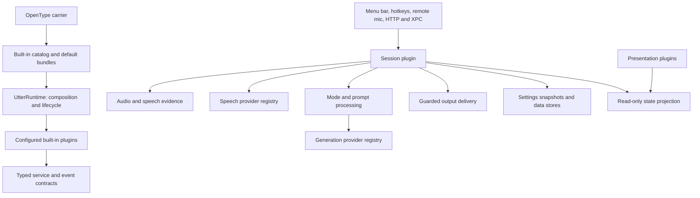

# Spec: Compose Utter from replaceable built-in plugins

**Status:** approved
**Approved-by:** User (conversation: “确认”)
**Approved-date:** 2026-10-03
**Upstream:** [intent.md](intent.md)

## Context and approach

The [approved intent](intent.md) covers all built-ins and configurable composition.
Existing engines, platform effects, stores, policies, and views remain the starting
point. DeepSeek Harness supplies the [composition principles](https://github.com/deepseek-ai/deepseek-harness/blob/master/docs/architecture.md),
including replaceable orchestration and reversible registrations.

Ponytail `full` favors existing speech/ownership/snapshot/model-gate contracts,
prompt assembly, transcript guards, and platform implementations. New machinery
is typed registration, graph validation, scopes, and configuration composition.

| Approach | Implementation | Verification | Migration | Operation | Maintenance |
| --- | --- | --- | --- | --- | --- |
| Continue patching the executable | Lowest initial cost; repeated routing edits | Recheck both coordinators and implicit globals | Small individual diffs | Current startup/lifecycle coupling remains | Does not meet replaceability; duplicate fixes continue |
| Replace module boundaries | Moderate; extract working code and consolidate execution | Reuse regressions plus boundary/fault tests | Incremental, without existing-data conversion | Explicit owners and failure attribution | Selected: one implementation per capability, enforced imports |
| Rewrite the entire application | Highest; recreate platform and inference behavior | Reestablish all audio, permission, quality, and release evidence | Largest compatibility and rollback burden | New runtime behavior across every user path | No demonstrated benefit over bounded replacement |

## Modules and ownership

A module is a SwiftPM compilation boundary; a plugin is a configurable feature.
Plugins with the same dependencies may share a target. Each stateful service or
distinct capability has one owner; its views/helpers inherit that lifecycle.

All plugin targets depend on `UtterRuntime` and their relevant contract targets.
They import no sibling implementation target. Only `UtterBuiltins` imports all
implementations, binding IDs to factories without implementing feature behavior.
Library sources/resources have disjoint target paths under `Sources/`; the
executable's path covers only its thin carrier. `SourcesCLI` remains the client.
Use Swift `package` access where possible; extraction need not publish engine APIs.

| Target boundary | Plugins / responsibility | Additional dependencies |
| --- | --- | --- |
| `UtterRuntime` | Typed keys, plugin graph, scopes, composition diagnostics | Foundation only; no product contracts |
| `UtterContracts` | Session/configuration/store/model/generation contracts and compatible transport value models | Foundation and runtime |
| `UtterMediaContracts` | Speech/capture contracts, owned audio and image values | Contracts, AVFoundation, CoreGraphics |
| `UtterPresentationContracts` | Identified window/tab contributions and main-actor view factories | Contracts, AppKit, SwiftUI |
| `UtterSession` | `session`: admission, execution state, event sequence, commit coordination | Contracts and media contracts |
| `UtterData` | Configuration, settings, credentials, history, dictionary, lexicons, memory, diagnostics | Contracts, Security, OS logging |
| `UtterModels` | Catalog, downloads, model storage/status, resource reservations | Contracts, Foundation networking; Hub where already needed |
| `UtterProcessing` | Dictation/format/translation/edit strategies, prompt catalog, fidelity and transcript policies, configured generation fallback | Contracts and media contracts |
| `UtterAudio` | Local capture, file input, device selection, speech evidence | Media contracts, CoreAudio, SoundAnalysis |
| `UtterRemoteMic` | Remote source, Bluetooth protocol/session/pre-roll | Media contracts, CoreBluetooth |
| `UtterAppleSpeech` | Apple analyzer and its existing streaming/legacy fallback | Media contracts, Speech |
| `UtterWhisper` | Whisper provider and streaming adapter | Media contracts, WhisperKit |
| `UtterMLX` | Qwen/FireRed/Mega speech, MLX generation/VLM, backend cleanup | Contracts/media contracts, existing MLX/audio/tokenizer dependencies |
| `UtterANE` | ANE-LM generation adapter | Contracts, ANELMRuntime |
| `UtterRemoteInference` | Volc speech and existing remote LLM protocol adapters | Contracts/media contracts, Foundation networking |
| `UtterMacServices` | Hotkeys, permissions, screen/selection context, insertion/replacement, correction capture, sounds, launch-at-login | Contracts/media contracts, existing macOS frameworks |
| `UtterPresentation` | Menu bar, overlay, settings sections, onboarding, history, models, about, appearance, recovery | Presentation/media contracts; feature metadata, not engine imports |
| `UtterBuiltins` / executable products | Factories, shipped bundles, OS entry and termination; CLI remains a transport client | Builtins imports implementations; CLI uses compatible contracts |

Speech/text/image plugins sharing an inference target remain separately selectable.
Core contracts contain no concrete engines or `NSRunningApplication`; media
contracts retain native buffers. UI benchmark results become contract values.

## Service, provider, and event contracts

- `PluginDescriptor` declares a stable ID, configuration schema version, required
  services, and supplied services. Optional dependencies are declared too.
- `ServiceKey<Value>` ties an identity to a Swift type. Registration and lookup
  use the same typed key; confined internal type erasure checks the type and
  never exposes an untyped service dictionary to feature code.
- A main-actor `PluginContext` exposes declared dependencies and a lifecycle
  scope. Undeclared lookups and duplicate singleton services are errors.
- Provider registries are single services with scoped contributions. Multiple
  speech or generation providers are valid; duplicate provider IDs are not.
  Descriptors supply model metadata, capabilities, availability requirements,
  legacy selection IDs, and factories. Selection resolves a descriptor rather
  than switching over concrete engine types.
- `SessionService` owns admission, start/stop/cancel, imported-audio execution,
  result/state queries, and event subscriptions. Entry plugins supply source,
  authorized principal, requested mode, and target identity; they do not own an
  alternative execution coordinator.
- `CaptureService` yields one owned recording handle with audio URL, activity,
  source generation, and cleanup. File input cannot delete caller-owned files;
  remote capture never silently falls back to the computer microphone.
- `SpeechProvider` retains prepare, streaming, final recognition, cancellation,
  and recognition context semantics. The selected session retains its provider
  until work drains, even after a selection changes.
- `GenerationProvider` accepts prepared prompt/options and optional supported
  media, returning text plus typed backend/fallback outcome. The processing
  fallback plugin calls ANE and MLX by contracts; providers do not import each
  other. Cancellation never starts fallback.
- `ModelService` owns authoritative status and reservations for loaded models,
  warmup, benchmarks, and unload. Backend adapters implement loading/cleanup;
  they do not independently publish conflicting readiness flags.
- `SettingsService` supplies immutable session choices; history, dictionary, and
  memory services own their existing stores. Memory projects authorized history
  instead of adding another copy. Learning uses the same dictionary service.
- `DeliveryService` prepares target operations and returns typed receipts for
  insertion, guarded replacement/edit, copy fallback, or result-only delivery.
  `PresentationService` contributes identified sections/windows and receives
  projections; views cannot write session phase or success history.

Typed events communicate observations, not commands that bypass admission.
Session events carry session ID, execution generation, sequence, and immutable
payloads. Main-actor publication preserves order. Scoped observers are isolated
from the producer, cannot mutate terminal decisions, and cannot prevent cleanup.
Progress/preview events may coalesce; terminal events never drop. Snapshot plus
subscription is atomic. Terminal state and its event sequence settle before any
subscriber callback, so synchronous observers cannot interleave a second commit.

Interception uses only existing, explicit seams: mode processing and prompt
sections have deterministic ordered contracts. Speech validation, authorization,
and output commit remain required service calls. There is no general middleware
chain capable of silently skipping these gates. Sensitive audio, images,
credentials, dictionary snapshots, and raw transcripts are not general events;
UI and authorized integration subscribers receive only their permitted payloads.

## Configuration composition

Versioned JSON is data decoded through `Codable`. Built-in factories are compiled
into the signed app; configuration never imports code or evaluates expressions.
Shipped bundles compose a `desktop` profile reproducing current behavior. A
minimal `recovery` profile contains configuration diagnostics and native recovery
presentation with capture, inference, output, hotkeys, and servers disabled.

The document contains `schemaVersion`, ordered `bundles`, plugin rows identified
by `id` with `enabled` and typed `configuration`, and selected capability bindings.
Rows reference catalog IDs; they cannot declare arbitrary service implementations.
Precedence is shipped bundle/default layers in declared order, legacy preference
projection, then explicit user profile/plugin/binding overrides. Defaults cannot
overwrite an existing provider preference. Replacing a row replaces its
configuration as a whole; implicit deep merging does not hide old values.
Repeated rows within one layer, unknown IDs/fields, invalid settings/bindings,
missing required services, duplicate exclusive providers, and cycles fail
validation with the profile, plugin, field, and dependency chain identified.

The configuration plugin owns the new composition document and presents one
effective configuration. Existing settings remain in their current UserDefaults
and credential locations. Provider descriptors translate legacy IDs without a
second selection engine. UI changes update the authoritative active layer and
mirror compatible legacy fields for rollback; they never write an overridden
field and claim that the effective setting changed. Secrets remain outside the
composition document. It is saved atomically and validated before replacement.

Provider choices and ordinary behavior preferences take effect at the next
session through a new immutable snapshot. Structural plugin/bundle changes are
validated and saved for restart, with effective/pending structure shown in the UI.
Disabled feature controls cannot invoke absent services. Existing remote-mic and
developer-interface toggles still start/stop their installed plugins' scoped
resources immediately; disabling/revoking never waits for restart. Graph mounting
and a mounted feature's live operational settings are distinct contracts.

An invalid user document is preserved; startup reports the error through the
prevalidated recovery profile. It does not silently select another microphone,
provider, or permissive default. Recovery offers an explicit return to the
shipped composition with an unchanged backup of the user's document.

## Activation, teardown, and concurrency

The runtime validates the complete selected graph before invoking factories.
Dependency order uses stable IDs to break ties. Boot stages services/effects and
becomes ready only after all configured plugins activate; failure rolls back.
Ingress rejects work before readiness. Model/permission unavailability is explicit
provider metadata, rather than an activation failure. Descriptor registration
does not request TCC permissions or load every provider model.

Every subscription, contribution, window, timer, hotkey, server, capture, and
owned task has an idempotent disposer in its plugin scope. Failure disposes the
partially activated plugin and then the activated graph in reverse dependency
order; effects unwind in reverse registration order. Cleanup errors aggregate
without skipping other disposers. A leaked or undrained scope prevents readiness
of a replacement graph and produces a diagnostic, rather than being forgotten.

Shutdown first closes admission, revokes ingress, cancels provisional/session
work, awaits owned tasks and delivery cleanup, then disposes dependent plugins
before providers/stores. Cancellation revokes a lease immediately but releases
it only after all work drains. Stale callbacks check both graph and session/source
generations. Teardown does not cancel or free a newer generation's resources.

Runtime coordination, session transitions, platform effects, and UI remain
`@MainActor`; existing inference actors do background work. Audio callbacks hand
native buffers synchronously to their owning session; crossing executors requires
an explicitly owned copy/lifetime. No new blanket `@unchecked Sendable` suppresses
isolation errors. Shared accelerator reservations serialize prepare/generate/
benchmark/unload as required; MLX cache clearing stays inside its backend owner.
Existing task-local reentrancy and request-local fallback outcomes remain scoped.

## Session state and output boundaries

Created API sessions are resource-free until execution admission. The single
Session service then acquires ownership, captures settings/dictionary/provider/
target choices, prepares, records or imports, validates speech, transcribes,
processes, validates output, and prepares delivery. Every await is followed by a
current-lease check before further work or publication. Streaming partials stay
provisional. Public integration state names, event names/order, and error payloads
remain projections of this owner; transports cannot maintain separate state.

The commit boundary authorizes exactly one delivery operation after validation,
current authorization, and target checks. Preparation may await activation or
model work but cannot insert, copy, edit, or write success history. Result-only
integration delivery records success and terminal events in one main-actor
settlement without an await or subscriber reentrancy between its decisions.

Native delivery is not atomic with another app's document. `TextInserter` posts an
irreversible key and delays clipboard restoration so the target can read it.
Cancellation accepted before commit produces no delivery. After commit starts,
cancellation/teardown awaits its receipt and cleanup; delivered output cannot
become an effect-free cancelled operation. Uncertain paste follows existing
copy/manual recovery, never automatic retry. Ownership remains held while the
receipt drains. This interpretation of criterion 6 requires design approval.

Receipts distinguish result publication, native submission, copy recovery,
uncertain delivery, and no delivery. Submission does not prove target consumption.
Each identifies its operation/history record; settlement is process-idempotent.
Only publication/submission adds history; replacement updates that record ID.
Instant insertion requires validated speech/transcript and commits its initial
text independently of background formatting. Later formatting is a tracked
job; failure or cancellation preserves the inserted text. Applying a replacement
reacquires ownership and validates generation, target, anchor, and expiry. It
does not update whichever unrelated history record happens to be latest.

Process loss after a posted key can leave delivery uncertain. Restart never
replays it; exactly-once external delivery across process crashes is not promised.

## Privacy, compatibility, and failure containment

Built-ins share process trust; declarations are not a sandbox. Existing TCC,
client identity/capability authorization, HTTP loopback/token behavior, screen
capture checks, secure-field correction exclusions, dictionary scope, speech
evidence, echo rejection, prompt fidelity, and focus/clipboard guards remain
mandatory. Privileged services recheck relevant authorization at use/commit.
Removing an ingress client cancels only that client's owned work. Permission
refusal remains recoverable, and Apple Speech authorization remains demand-led.

Existing dataset schemas/paths and credential representations are unchanged.
Only composition adds a format version; unknown future versions fail closed.
Existing identities, CLI, HTTP/JSON/SSE and XPC stay compatible; facades use the same Session service/store.
Pin XPC Objective-C protocol runtime identities before moving their declarations.

Targets expose owned bundles. `L("key")` retains English/Chinese parity, resolves
its localization bundle, and takes an injected language. Presentation owns
illustrations/icons; lexicons and sounds retain explicit resource owners.
Packaging continues copying all SwiftPM bundles, verifies an explicit manifest,
and builds through `xcodebuild` so inference Metal libraries are included. Runtime
lookup no longer depends on the single `OpenType_OpenType.bundle` name. Configured
signing and notarization rules remain unchanged.

## Contract tests and acceptance evidence

| Intent criteria | Required evidence |
| --- | --- |
| 1–2: boundaries/replacement | Runtime/contract-only test targets compile; import checks reject sibling engine/UI imports; fake speech/generation plugins replace built-ins through the production composition mechanism. |
| 3–4: composition/lifecycle | Invalid graph/configuration matrix; fault after each effect registration; repeated boot/stop; cancelled activation, throwing disposer, delayed task, and stale-source callbacks; no duplicate or leaked resources. |
| 5: unified execution | Existing `InputSessionOwnershipTests`, `RemoteMicPipelineIntegrationTests`, and integration tests run against the shared Session service with entry adapters; trace one owner and frozen choices for every source. |
| 6: effects/commit | Spy delivery/history/event services verify no effects before accepted commit, cancellation at each suspension, irreversibility/uncertain receipt behavior, no retry, and record-specific deferred replacement. |
| 7: behavioral parity | Existing speech, silent-input, prompt-prefix, dictionary learning, fidelity, edit/translation, Espresso fallback, model-access, authentication, and correction-privacy suites; fixtures pin inputs/outputs at each changed seam. |
| 8: upgrade/rollback | Existing-data fixtures open unchanged; old and new compatibility snapshots match; shipped/pending/recovery compositions preserve data and can return to the previous signed app. |
| 9–10: shipped product | SDLC/basic checks, `swift test`, release-style signed build, bundle/Metal manifest, real macOS light/dark/narrow-window QA, permissions, real microphone/remote-source paths, independent verification, and conflict-free PR. |

Fault tests precede seam replacement. Retarget existing tests to the owning module
without duplicating their assertions or exporting internals just for tests.
Engineering checks do not prove recognition quality: separately replay existing
speech/noise, short/quiet English/Chinese, Qwen-hint, and echo samples on macOS/
Apple Silicon. Linux without Swift supplies no build, TCC, or window evidence.

## Migration and rollback

Module extraction retains behavior while exposing contracts. Each converted
capability routes all callers through one service before its old production path
is removed. Shared Session consolidation replaces both existing execution
coordinators; transport/UI facades may remain, but own no lease, phase, event
sequence, or output policy. Global store access, concrete provider switches,
engine-type UI callbacks, and the hardcoded resource-bundle fallback disappear
as their owning boundaries converge. Intentional Apple/ANE fallback stays within
explicit capability contracts. No released composition selects two executors.

Rollout uses the shipped desktop composition with existing optional features.
Block release on leaks, duplicate output, permission/data/API changes, quality
regressions, or missing macOS evidence.
Independent verification and human PR/production gates remain required. Rollback
restores the previous configured signed artifact and disables the new
composition document without deleting it. Existing settings/data remain readable;
recovery of a composition never clears credentials, models, history, or dictionary.
