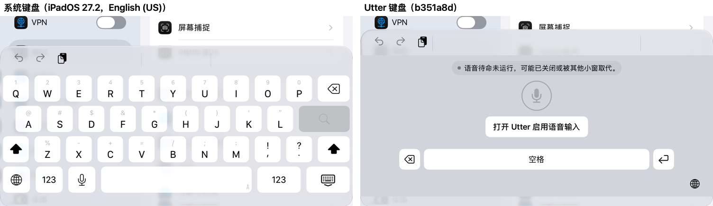
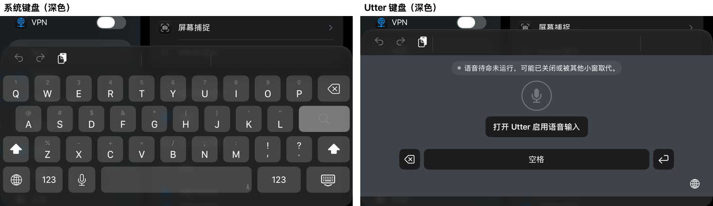
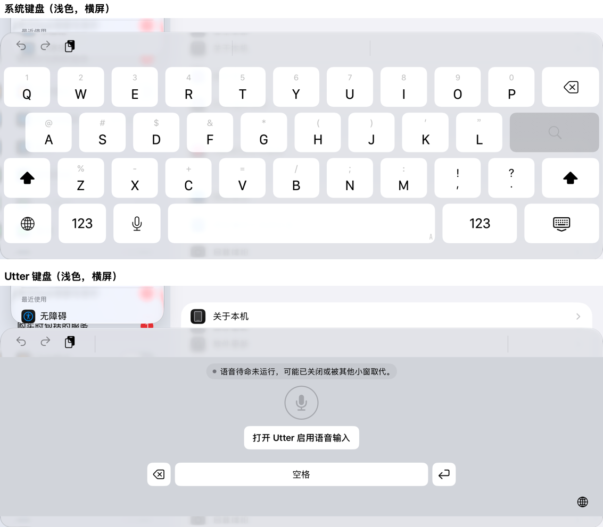
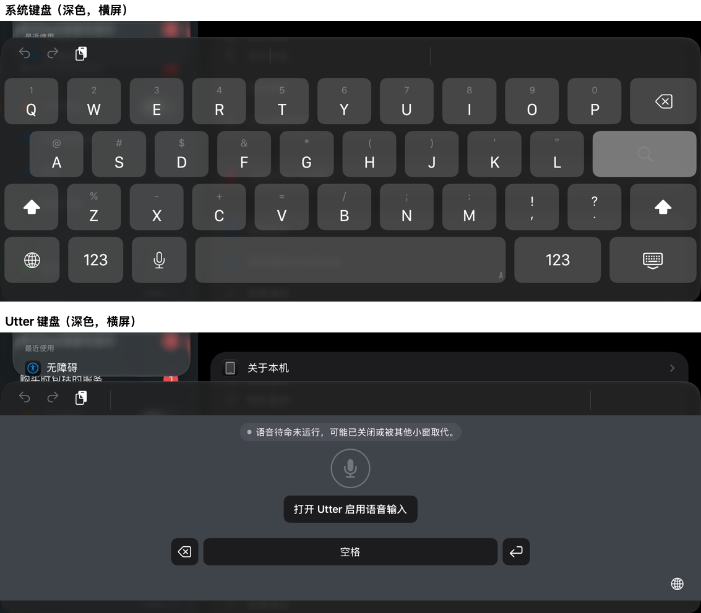

# Intent: iOS 语音键盘与系统键盘对齐

**Status:** approved
**Approved-by:** 用户（本对话：“全部批准，继续执行。”）
**Approved-date:** 2026-10-07
**Risk:** medium
**Upstream:** 用户（本对话，2026-10-06）：“还有现在这个键盘的整体的ui按键的形状，还有位置布局跟系统原生的差了很多，我希望嗯至少在颜色和形状上跟系统原生的保持一致，对吧，特别是那个切换输入法的位置，你一会在左边一会在右边是很难受的。” 上游 bundle：`2026-10-06-keyboard-ui-redesign`（已批准的“听写台”视觉层，本 intent 修订其颜色、形状与布局）。

**执行说明（2026-10-06）：** 用户随后指示“把我们刚才说那些问题修复了，现在新的结论是什么？”。据此开始实现，并按本文建议值处理三个开放问题；同一指示把对标文档中已批准验收项“按住录音松开结束、开始未确认前松手也不能迟到启动”和识别文本标点前多余空格并入本 intent。该指示不是对任何阶段的正式批准：该指示发生时各阶段仍为 `pending approval`；2026-10-07 用户回复“全部批准，继续执行。”后，本 bundle 各阶段均已批准。

## Problem

用户在系统键盘与 Utter 键盘之间来回切换时，两者的颜色、按键形状、位置布局都明显不同；最难受的是切换输入法的地球键：系统键盘在底排最左，Utter 在右下角，“一会在左边一会在右边”，每次切换都要重新找。

以下是在 iPad mini (A17 Pro, iPadOS 27.2) 真机上的实测（提交 `b351a8d`，设置 App 搜索框，系统键盘为 English (US)，由 `iOS/UITests/UtterDeviceKeyboardReference.swift` 采集，原始几何见 [keyboard-geometry.txt](evidence/keyboard-geometry.txt)）：

| 项目 | 系统键盘 | Utter 键盘（现状） |
| --- | --- | --- |
| 切换输入法（地球） | 底排**最左**键：竖屏 frame 3,1048.5 · 69×64.5（可见键 x 6–62.5），横屏 frame 4,638.5 · 103×85.5 | **右下角**：竖屏 684,1064 · 44×44（距右缘 16），横屏 1073,675 · 44×44；无键帽 |
| 键盘表面 | 系统键盘半透明材质，透出宿主内容 | 自绘不透明底色：浅色 #D1D4DA，深色 #3F434A（偏蓝） |
| 浅色：键帽 / 底板 | 白 #FFFFFF–#FBFDFF（随位置略有差异）/ 约 #D9DBE1–#E2E3E8（半透明，随位置变化） | 白 / #D1D4DA（底板比系统暗约 10–15） |
| 深色：键帽 / 底板 | #454646 / #212223，键帽**比底板亮** | #1C1C1E / #3F434A，键帽**比底板暗**，明暗关系相反 |
| 键尺寸与间距（竖屏） | 可见键约 54.5×54，横向间距 12，行距 64.5，左右边距 6 | 删除/换行 44×44，空格 476×44，无统一网格 |
| 键圆角 | 圆角曲线沿上边延伸约 9.5、沿侧边延伸约 8.5 | 10 的标准圆弧圆角（`RoundedRectangle(cornerRadius: 10)`） |
| 键盘总高（含 55 辅助栏），竖屏 / 横屏 | 340 / 428 | 固定 375（55 辅助栏 + 300 内容 + 约 20 底部留白）：竖屏高 35，横屏矮 53，切换键盘时宿主内容上下跳动 |

颜色取自 2× 截图像素，圆角为 0.5pt 栅格轮廓估计，位置/尺寸来自 accessibility frame；均不依赖私有 API。总高以辅助栏顶边计：竖屏系统 793、Utter 758（均为实测）；横屏 Utter 369 为实测，系统键盘的辅助栏顶边 316 由键区 y=371 减 55 推得。系统键盘的几何与颜色会随 iPad 机型、系统版本与宿主内容变化，所以验收不写死数值，而与同一次运行中测得的系统键盘比较。

旧要求的取代：`2026-10-04-ios-support/plan.md` 第 32 行与 `2026-10-06-keyboard-ui-redesign/spec.md` 第 26 行记录的是“右下角地球”。用户本次明确指出该位置与系统键盘不一致，以本次指令为准，旧位置要求由本 intent 取代。

## Outcome

Utter 键盘与系统键盘并排使用时不再有突兀感：

- 切换输入法键在系统键盘同一位置（底排最左），竖屏、横屏一致，且键盘上只有一个切换入口；
- 键盘表面使用系统键盘的底板材质，键帽的颜色、圆角、间距、边距与系统键帽一致（浅色、深色各一）；
- 键盘总高度与系统键盘一致，在系统键盘与 Utter 之间切换时宿主内容不跳动；
- 语音键同时支持“点按开始、再点按结束”和“按住说话、松开结束”（对标豆包/微信；来源：已批准的 [doubao-voice-parity.md](../2026-10-04-ios-support/doubao-voice-parity.md) “点击、按住、取消”一行）；开始未确认前松手不会迟到启动录音；
- 识别结果不再带全角标点前后的多余空格（现状稳定出现“见面 ，请”）；
- 语音状态、录音、取消、插入、编辑等其余行为与桥接契约不变。

## Scope

- `iOS/Keyboard/` 的颜色、键帽形状、间距、布局、地球键位置、键盘表面材质与高度，以及语音键的触摸交互；
- `Sources/UtterKeyboardBridge/` 新增纯逻辑的语音键手势状态机（只依赖 Foundation）及其单元测试；
- `Sources/UtterProcessing/TranscriptionSanitizer.swift` 规整全角标点前后的空格，并补测试；
- 新增真机对照测试（`iOS/UITests/UtterDeviceKeyboardReference.swift` 及工程登记），在同一次运行里先测系统键盘、后测 Utter 键盘并自动比较；
- 必要的界面文案进入 `Sources/UtterContracts/Resources/{en,zh-Hans}.lproj/Localizable.strings`。

非目标：不实现字母、拼音、手写或表情输入，也不复刻系统键盘的 123、听写、收起键盘等键；不改桥接协议、录音/租约/代次语义、主 App 界面；不引入新权限或数据；不专门适配浮动与拆分键盘（只要求不崩溃、不遮挡）；不使用私有 API 或系统私有资源复刻外观。

## Constraints

- 以下 accessibility 标识符与语义不变：`keyboard.status`（含 `.value`）、`keyboard.start/stop/insert/activate/result/space/return/delete/cancel/globe`；地球键仍使用 `handleInputModeList(from:with:)`，点按切换下一个键盘，长按弹出输入法列表；
- 既有真机键盘流程（KeyboardSpeech / AfterIdle / DisplacedByVideoRecovers / DocumentLifecycle / AppearanceAndVoiceOver / ReduceMotion / MaximumText）的断言不放宽；
- 浅色/深色、动态类型最大字号、VoiceOver、减弱动态效果继续可用；
- 系统若自己提供切换输入法入口（`needsInputModeSwitchKey == false`，例如部分 iPhone），Utter 不再画第二个；该分支在 iPad 与 iPhone 模拟器上的表现由 spec 核实；
- 真机验证以这台 iPad mini 为准，系统键盘的参照值来自同一次测量。

## Acceptance criteria

均在同一次真机运行内与系统键盘比较，浅色/深色 × 竖屏/横屏四种组合各验证一次（共 4 组截图与数值，记入 `verification.md`）：

1. **地球位置**：Utter 地球键可见区域的左边缘、垂直中心与系统键盘地球键的偏差 ≤ 2pt；Utter 右下不再有地球键；键盘上同时只有一个切换输入法入口。点按切换、长按列表的既有真机测试通过。
2. **总高度**：Utter 键盘辅助栏顶边与系统键盘偏差 ≤ 2pt，切换键盘时宿主内容不移动。
3. **键盘表面**：不再绘制自有不透明底色；选定取样点与系统键盘对应点的颜色逐通道差 ≤ 8（浅色、深色各一）。
4. **键帽颜色**：键帽填充与系统键帽逐通道差 ≤ 6；深色下键帽比底板亮，与系统一致。
5. **键帽形状与网格**：键的圆角轮廓与系统键相差 ≤ 1pt；左右边距、键间距、行距与系统键盘相差 ≤ 1pt。
6. **行为不变**：第 Constraints 条所列既有真机流程在不改断言的前提下全部通过；`keyboard.*` 标识符清单与现在一致。
7. 四种组合的并排截图已实际查看，没有截断、重叠或文字不可读；最大字号与 VoiceOver 仍可操作。
8. `bash scripts/sdlc-checks.sh`、`bash scripts/ci-basic-checks.sh`、`swift test` 通过，iOS `build-for-testing` 通过。
9. **按住说话**：在 iPad 真机上，按住语音键期间录音并播放固定语音，松开后结束并出结果，插入一次；点按开始、再点按结束的既有流程不变；VoiceOver 双击仍是“开始/结束”。
10. **不迟到启动**：按住不足以确认开始就松手（≥0.4 秒）时，不会在松手后进入录音（松手后 4 秒内状态不为 recording，也不产生可插入结果）；该判定另有纯逻辑单元测试覆盖。
11. **标点空格**：`TranscriptionSanitizer` 对“字符 + 空格 + 全角标点”的输入去掉空格，单元测试覆盖；真机固定中文语句的结果不再含“见面 ，”。

## Open questions（已按建议值处理，待用户确认）

以下三项用户未逐项回答，实现按各自的建议值进行；若不同意，可在批准 spec 时改。

1. **主语音键的形状 → 采用 B**（系统键帽形状）：键盘中央的开始/停止原先是 64 的圆形蓝/红键，系统键盘上没有对应物（听写键只是底排普通键）。A 保留圆形主键；B 改成系统键帽形状（大圆角矩形，键帽配色，图标与文字用强调色，录音中变红）。采用 B，因为用户要求“颜色和形状上跟系统原生的保持一致”。
2. **范围 → 以 iPad 为验收对象**：键盘网格、高度与对照测量只在 iPad mini 真机上校准和验收；iPhone 只保证不退化（同一键帽样式，不画第二个地球键的判断由真机与模拟器取值核实），不宣称与 iPhone 系统键盘对齐。
3. **底排构成 → 采用建议**：地球（最左，与系统同位）· 空格 · 换行；删除放在系统删除键的位置（右上）；取消键在删除键左侧，仅在录音/识别中出现。

## 追加（2026-10-06，用户反馈）：键帽缺少半透明效果

用户试用后指出：“你的按钮根本没有半透明的效果，跟系统的长得不一样。”核对结论：用户是对的，而且我们的验收测不出这个问题。

- 本 intent 自己的“现状”表已写明系统键盘表面是半透明材质、底板色“随位置变化”。但实现里把键帽当成**不透明纯色**（浅 `#FFFFFF`、深 `#464646`），那是系统键帽在**某一个背景**上被取样出来的结果。
- 对照测试在同一宿主、同一背景下取样，不透明色与半透明色在这一点上数值相同，所以四种组合都“通过”。它证明了位置、尺寸、圆角与单点颜色，**没有证明材质**。
- 模拟器与真机的系统底板色不同（222,224,231 对 216,218,224），也说明系统颜色依赖背后内容。

新增验收条件（取代“键帽颜色逐通道差 ≤ 6”中仅单点比较的做法）：

1. 键帽使用带透明度的填充/材质，让背后的键盘底板与宿主内容透出；不再写死不透明色值。
2. 对照测试在**至少两种不同背景**（浅背景宿主与深背景宿主）下同次运行取样系统键帽与 Utter 键帽，逐通道差 ≤ 6，并且两种背景下系统键帽色确实不同（用来证明这个测试能识别半透明）。
3. 并排截图肉眼看不出材质差异；按下态同样半透明。

状态：只有 intent 追加，尚未改代码。实现前要先做一次测量：在两种背景下取系统键帽色，反推填充色与透明度，再写进 spec。这一项不需要产品决策，你一句“开始”我就做。
