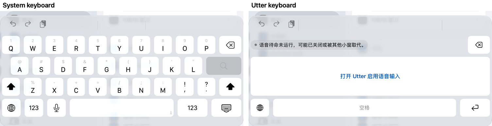
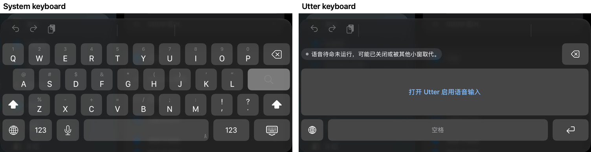
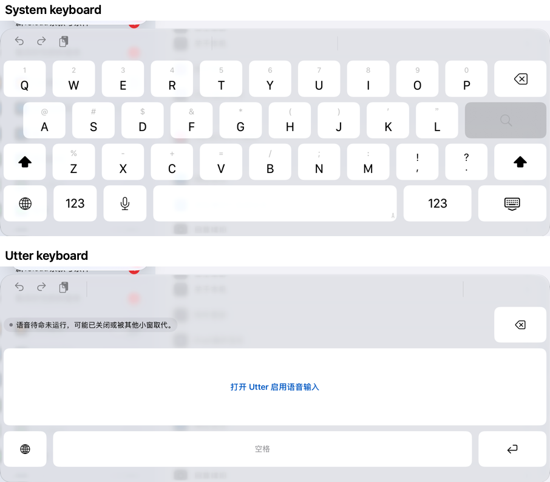
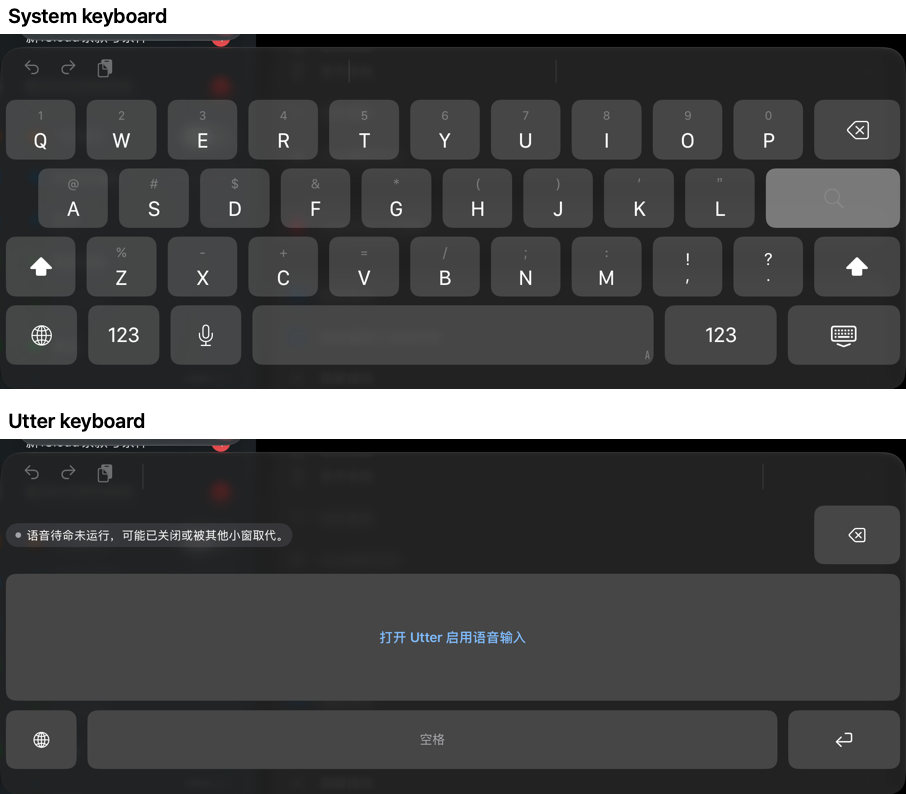

# Verification: iOS 语音键盘与系统键盘对齐

**Status:** approved
**Approved-by:** 用户（本对话：“全部批准，继续执行。”）
**Approved-date:** 2026-10-07
**Upstream:** [plan.md](plan.md)（intent、spec、plan 均已批准，2026-10-07）

## 结论

iPad mini（A17 Pro，iPadOS 27.2）上，Utter 键盘与系统键盘在浅/深 × 竖/横四种组合下同一次运行内逐项对齐：键盘顶边、地球键位置、删除键位置、底排顶边、键帽与底板颜色均相差 ≤ 1pt 或 ≤ 1 个色阶，圆角缩进相差 ≤ 0.5pt。按住说话、松手结束在真机跑通，识别结果不再带“见面 ，”的多余空格。

**没有完成的部分**：最终代码（含 iPhone 相关改动）没有在真机上重跑；既有真机键盘用例 7 条中 4 条已在 iPhone 改动前的构建上重跑通过，`AppearanceAndVoiceOver`、`MaximumText`、`DocumentLifecycle`、`AfterIdle`、`DisplacedByVideoRecovers` 5 条没有重跑——iPad 在重跑时弹出“Enable UI Automation，使用触控 ID 以继续使用 XCTest”，这一步只能由本人按指纹。所以验收标准 6、7（最大字号与 VoiceOver）尚未在最终构建上闭合，见“未完成与残余风险”。

## 验收标准逐条

| # | 标准 | 证据 | 结果 |
| --- | --- | --- | --- |
| 1 | 地球位置：左边缘、垂直中心偏差 ≤ 2pt；右下不再有地球键；只有一个切换入口 | 四种组合的对照数值全部 Δ 0.0；`keyboard.globe` 是键盘上唯一的切换键，旧右下角地球已删除；对照测试自己就是用 Utter 的地球键长按列表切回系统键盘，四组均成功 | 通过；点按切换在真机的既有用例未在本构建重跑 |
| 2 | 总高度：辅助栏顶边偏差 ≤ 2pt | 竖屏 793 / 793，横屏 316 / 316，Δ 0.0（见下表） | 通过；“宿主内容不跳动”由高度相等推得，没有单独做宿主截图差分 |
| 3 | 键盘表面：不绘制不透明底色；取样点逐通道差 ≤ 8 | 四组底板取样点与系统完全相同（差 0） | 通过 |
| 4 | 键帽颜色逐通道差 ≤ 6；深色下键帽比底板亮 | 浅色 255/255/255 对 255/255/255；深色最大差 1 | 通过 |
| 5 | 键帽圆角轮廓 ≤ 1pt；边距、间距、行距 ≤ 1pt | 圆角缩进差 0.0–0.5；左边距、删除键左边、底排顶边 Δ 0.0；横屏第一行删除键比系统低 1.0pt（像素核对：系统 382.0，Utter 383.0） | 通过，横屏第一行恰在 1pt 线上，没有再调 |
| 6 | 既有真机键盘用例在不放宽断言下通过 | 已重跑：`ReleaseKeyboardEditing`（四个方向）、`KeyboardFullAccessOff`、`KeyboardReduceMotion`、`StandbyKeyboardSpeech`；未重跑：见下 | **部分**：5 条待触控 ID 授权后重跑 |
| 7 | 四种组合并排截图已查看；最大字号与 VoiceOver 仍可操作 | 四张并排截图已逐张查看，无截断、重叠；最大字号与 VoiceOver 的用例未重跑 | **部分** |
| 8 | `sdlc-checks`、`ci-basic-checks`、`swift test`、iOS `build-for-testing` 通过 | 见“自动化门禁” | 通过 |
| 9 | 按住说话：按住期间录音，松开后出结果，插入一次 | `testDeviceKeyboardHoldToTalk` 通过，结果 `今天下午 3:00，我们在公园见面，请记得带一瓶水。`；点按开始/结束由 `StandbyKeyboardSpeech` 通过 | 通过；VoiceOver 双击语义由 `AppearanceAndVoiceOver` 覆盖，未重跑 |
| 10 | 不迟到启动 | 纯逻辑：`testHoldReleasedBeforeStartIsConfirmedCancelsSoItCannotStartLate` 等 16 个用例；真机：`testDeviceKeyboardHoldReleasedEarlyDoesNotRecordLate` 通过 | 通过，限制见下 |
| 11 | 标点空格 | 单元测试两条；真机点按与按住两条路径的结果均为“见面，请” | 通过 |

标准 10 的限制：真机用例按住 0.6 秒，结果是 `status=failed`（静音，识别失败），说明主 App 在 0.6 秒内已确认开始，松手走的是“停止”分支，而不是“开始未确认就取消”分支。设备上无法稳定制造“未确认”的窗口，所以这个分支只由纯逻辑单元测试证明；真机用例证明的是结果层面：松手后状态不是 `recording` / `preparing`，没有可插入的结果，再点按仍能录音并取消。

## 自动化门禁

最终代码树上：

| 命令 | 结果 |
| --- | --- |
| `swift test` | 472 个用例，17 个跳过，0 失败；其中 `VoiceKeyGestureTests` 16 个、`TranscriptionSanitizerTests` 新增 2 个 |
| `bash scripts/sdlc-checks.sh` | 通过 |
| `bash scripts/ci-basic-checks.sh` | 通过 |
| `bash scripts/check-ios-bridge.sh` | 通过 |
| `python3 scripts/check-module-boundaries.py` | 通过（`UtterKeyboardBridge` 仍只依赖 Foundation） |
| `git diff --check` | 干净 |
| iOS `xcodebuild … build-for-testing`（真机，Debug） | `BUILD_EXIT=0` |
| Swift 文件长度 | 全部 < 300 行（最长 `Package.swift` 292、`UtterSimulatorSettings.swift` 290、`KeyboardController.swift` 257） |

## 真机运行（iPad mini A17 Pro，iPadOS 27.2）

**构建范围**：这些运行发生在 iPhone 相关改动（按设备类型选网格、`bottomSpacer` 只用于 iPad、iPhone 横屏安全区内缩）之前。那批改动在 iPad 路径上不应改变数值，间接证据是 iPad mini 模拟器在改动后的代码上得到与真机逐项相同的 frame（见“模拟器补充证据”），但**最终代码没有在真机上重跑**，批准前应在真机上再跑一次对照与按住说话。

| 运行 | 用例 | 结果 | 用时 |
| --- | --- | --- | --- |
| kbd-final-1 | `testDeviceKeyboardNativeAlignment`（浅/深 × 竖/横，同一次运行比较） | 通过 | 169.9 秒 |
| kbd-final-1 | `testDeviceKeyboardHoldToTalk` | 通过 | 39.8 秒 |
| kbd-final-1 | `testDeviceKeyboardHoldReleasedEarlyDoesNotRecordLate` | 通过 | 40.5 秒 |
| kbd-reg-1 | `testDeviceReleaseKeyboardEditing`（竖、横左、横右、倒置） | 通过 | 38.5 秒 |
| kbd-reg-1 | `testDeviceKeyboardFullAccessOff` | 通过 | 50.6 秒 |
| kbd-reg-1 | `testDeviceKeyboardReduceMotion` | 通过 | 52.4 秒 |
| kbd-reg-1 | `testDeviceStandbyKeyboardSpeech` | 通过 | 44.7 秒 |

原始输出：[keyboard-alignment-probe.txt](evidence/keyboard-alignment-probe.txt)。

### 对照数值（Utter 减去系统，单位 pt）

对照测试的断言：键盘顶边、地球左边与垂直中心、地球底边、删除键左边与垂直中心、底排顶边 ≤ 2；圆角缩进 ≤ 1；键帽 ≤ 6、底板 ≤ 8（逐通道）。系统键的 accessibility frame 比可见键向左多 3pt、向上多 1pt，已在比较里换算。

| 组合 | 键盘顶边 | 地球左边 | 地球垂直中心 | 删除键左边 | 删除键垂直中心 | 底排顶边 | 圆角缩进 系统 / Utter | 键帽色 系统 → Utter | 底板色 系统 → Utter |
| --- | --- | --- | --- | --- | --- | --- | --- | --- | --- |
| 浅 竖 | 0.0 | 0.0 | 0.0 | 0.0 | 0.0 | 0.0 | 8.5 / 8.5 | 255,255,255 → 255,255,255 | 216,218,224 → 216,218,224 |
| 深 竖 | 0.0 | 0.0 | 0.0 | 0.0 | 0.0 | 0.0 | 8.5 / 9.0 | 69,70,71 → 70,70,70 | 33,34,35 → 33,34,35 |
| 浅 横 | 0.0 | 0.0 | 0.0 | 0.0 | +1.0 | 0.0 | 10.5 / 11.0 | 255,255,255 → 255,255,255 | 205,209,215 → 205,209,215 |
| 深 横 | 0.0 | 0.0 | 0.0 | 0.0 | +1.0 | 0.0 | 11.0 / 11.0 | 69,70,70 → 70,70,70 | 32,35,37 → 32,35,37 |

横屏“删除键垂直中心 +1.0”不是测量误差：系统横屏第一行键顶在 382.0，Utter 在 383.0（`/tmp/utter-pixels … col` 逐像素核对）。系统横屏四行键顶为 382 / 468 / 553.5 / 639.5（第一、二、四行为像素核对，第三行由 accessibility frame 加 1pt 推得），平均行距 85.83，而 Utter 用 85.5，故第一行差 1.0、第二三行差 0.5、底排为 0。若要消除，横屏上边距改 11、行距改 85.8333（键区总高不变），需要再跑一次对照测试确认，这次没有做。

### 并排截图（上/左为系统键盘，下/右为 Utter）

这些截图是未开启待命的状态（“打开 Utter 启用语音输入”），因为对照测试不启用待命。语音键、结果态、录音态的截图见 `kbd-final-1` 与 `kbd-reg-1` 的附件，已逐张查看。






### 按住说话输出

```
DEVICE_HOLD_RESULT 今天下午 3:00，我们在公园见面，请记得带一瓶水。
DEVICE_HOLD_EARLY_RELEASE status=failed
```

按住用例按住语音键 10 秒，语音在按住 3 秒后开始播放、约 8.4 秒结束；全程没有点“停止”，结果由松手触发。

## 模拟器补充证据

模拟器只作补充，不替代真机。Xcode 27 的无头 `xcodebuild test` 启动的模拟器默认挂着硬件键盘，软键盘不出现，所以每次运行前先执行 `swift scripts/sim-hardware-keyboard.swift <UDID> off`（调用 CoreSimulator 私有接口，仅限开发机，见脚本头注释）。

| 设备 | 用例 | 结果 | 原始输出 |
| --- | --- | --- | --- |
| iPhone Air（iOS 27.0） | `testProductGlobe`、`testProductKeyboardLayoutPortrait`、`testSimulatorKeyboardTransportAndEditing`、`testSimulatorFieldChangeCancelsAndRejectsOldResult`、`testSimulatorDelayedCancelDoesNotStopNextSession` | 通过 | `.build-ios/sim-kbd-6.log` |
| iPhone Air | `testProductKeyboardLayoutLandscape` | 通过（该用例在 `sim-kbd-6` 失败于测试的滚动方式，改为慢速短拖后在 `sim-kbd-8` 通过，产品代码没变） | `.build-ios/sim-kbd-8.log` |
| iPhone Air，最大无障碍字号 | `testProductKeyboardLayoutPortrait/Landscape` | 通过，截图已查看：状态胶囊三行、激活键需滚动到达、底排固定可点 | `.build-ios/sim-ax-1.log` |
| iPad mini（A17 Pro，iOS 27.0） | `testDeviceKeyboardNativeAlignment` | 通过（211.9 秒） | `.build-ios/ipadsim-align-1.log` |
| iPad mini，最大无障碍字号 | `testProductKeyboardLayoutPortrait/Landscape` | 通过（43.5 秒）；该模拟器没有“完全访问”，没有 `keyboard.activate`，用例对此分支跳过激活键可达性断言（第一次运行因此失败，修测试后通过） | `.build-ios/ipadsim-ax-2.log` |

这一轮发现并修好的真问题：紧凑网格（iPhone）沿用了 iPad 专用的 20pt 底部留白，视图高度 212 小于网格底边 220，底排被裁掉 8pt，地球键不可点——`testProductGlobe` 在 iPhone Air 上暴露了它。现在 `bottomSpacer` 只用于 iPad，网格按设备类型而不是只看宽度选择，iPhone 横屏按安全区内缩。

模拟器与真机的关系，来自 `ipadsim-align-1.log` 与真机 `keyboard-alignment-probe.txt` 的逐项对比：

- 浅色竖屏与横屏，系统键盘与 Utter 的 frame（辅助栏、地球、删除键、空格）在模拟器与真机上逐项相同；只有 Utter 的圆角缩进差一点（竖屏 9.0 对真机 8.5，横屏 11.5 对真机 11.0），系统键盘的缩进相同（8.5 / 10.5），仍在 1pt 容差内。
- **深色组合在模拟器上不能当证据**：日志里 `native-dark-*` 的键帽色仍是 255,255,255，说明 `XCUIDevice.appearance = .dark` 在模拟器上没有让键盘变深。该用例是系统与 Utter 同次运行相对比较，所以它在模拟器上“通过”，但深色颜色的对齐只由真机那一次运行证明。
- 底板色在模拟器与真机不同（例如浅色竖屏 222,224,231 对 216,218,224），因为系统底板随背后内容取色；这再次说明验收只能做同次运行的相对比较。

**没有完成**：iPad Pro 13 英寸模拟器的对齐运行（用来看线性缩放在最大屏上的偏差）。第一次因磁盘写满（`errno 28`）失败，磁盘腾出 20 GB 后重跑，`xcodebuild` 两次都卡在加载工程时的 `NSFileCoordinator` 访问授权上，未能进入构建；原因没有查清（本机 Xcode 正开着，没有去动它）。所以其他 iPad 机型仍是“按宽度线性缩放，未验证”。

## 校准过程中发现并修正的问题

- 第一次对照失败：删除键垂直中心 881.0 对 883.5，空格 1047 对 1049.5。原因是键盘视图底部有 5pt 安全区，`UIHostingController` 把内容整体上提 2.5pt；`safeAreaRegions = []` 后消除。
- 横屏键盘顶边差 0.5pt：下边距 30.5 改 31。
- 圆角：竖屏 9 的弧线小于系统，改 10；横屏 12.5 比系统大约 1pt，改 12（最终横屏缩进 11.0 / 11.0 与 10.5 / 11.0）。
- 视图高度 = 键区高度 − 20：系统在输入视图下另加 20pt 底部留白。

## 未完成与残余风险

**需要本人做一步才能继续的**：iPad 弹出的“Enable UI Automation，使用触控 ID 以继续使用 XCTest”是系统的生物识别确认，不能也不应由测试绕过。按一次指纹之后，下面的用例需要在最终构建上重跑：

| 用例 | 为什么要重跑 |
| --- | --- |
| `testDeviceKeyboardMaximumText` | 最大字号布局是新写的（滚动区 + 固定底排 + 视图加高 120pt） |
| `testDeviceKeyboardAppearanceAndVoiceOver` | VoiceOver 遍历顺序、语音键 `accessibilityActivate`、地球长按 |
| `testDeviceKeyboardDocumentLifecycle` | 十轮宿主切换、地球/删除/空格/换行可点 |
| `testDeviceStandbyKeyboardSpeechAfterIdle` | 五分钟闲置后仍能听写 |
| `testDeviceStandbyDisplacedByVideoRecovers` | 需要局域网夹具 `TEST_RUNNER_UTTER_FIXTURE_URL` 与 Safari 证书确认 |

其余风险：

- 只在 iPad mini（A17 Pro）上校准和验收。其他 iPad 机型按“屏宽 ÷ 参照宽”线性缩放全部数值，未验证；iPhone 使用紧凑网格，不宣称与系统键盘对齐。
- 对照只在设置 App 的搜索框一个宿主里做；系统键盘的几何与颜色会随宿主内容变化，所以验收用同次运行的相对比较。
- 这一轮没有对照豆包、微信：iPad 上没装它们的键盘。
- 还没动的上一份报告里的问题：移动端模型文字整理、混说/方言/噪声语料、三宿主各十轮矩阵、自动锁屏与强退恢复、`AVAudioSession` 实际释放断言、设备内下载本地模型的 TLS 失败（`A secure connection to the model server could not be established`，来自 `.build-ios/ipad-confucius-network.log`，网络环境问题，未排查）。

## 复现

```sh
export DEVELOPER_DIR=/Applications/Xcode.app/Contents/Developer
xcodebuild -project iOS/Utter.xcodeproj -scheme UtteriOS -configuration Debug -destination generic/platform=iOS \
  -derivedDataPath .build-ios/ipad-device DEVELOPMENT_TEAM=YOUR_TEAM "CODE_SIGN_IDENTITY=Apple Development" \
  -allowProvisioningUpdates build-for-testing
python3 scripts/test-ios-device-audio.py kbd-final-1 \
  testDeviceKeyboardNativeAlignment testDeviceKeyboardHoldToTalk testDeviceKeyboardHoldReleasedEarlyDoesNotRecordLate
```

iPad 需要解锁、靠近 Mac 扬声器，并在提示“Enable UI Automation”时按指纹。

## 追加：键帽半透明（2026-10-06）

用户指出键帽“没有半透明效果”。原因：此前用不透明 `#FFFFFF` / `#464646`，验收只对比了单一背景。现已用 `--backdrop-color`（DEBUG）给窗口铺色，在模拟器上取 5 种背景（浅、深、红、蓝、深+绿）的系统键帽与 Utter 键帽对比，系统键帽随背景变化（浅色 255→242…，深色 70→53），测得浅色约 0.85 白、深色约 0.165 白，`KeyColors.cap` 据此改为半透明；`testKeyboardKeysAreTranslucentLikeTheSystemKeys` 在 iPhone Air 与 iPad mini 模拟器通过，逐通道 ≤ 5。截图并排核对了红色背景下的系统键盘与 Utter 键盘。未做：真机复测、按下态单独测量、横屏。详见 `2026-10-06-keyboard-streaming-dictation/verification.md`。
